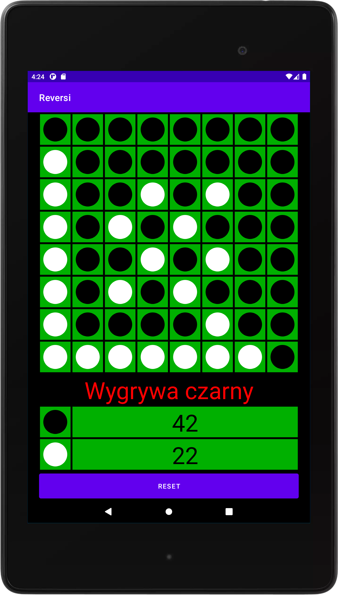

# Reversi
Gra polega na zapełnieniu całej planszy jak największą ilością koloru odpowiadającemu graczowi. 
Ruch do wykonania jest wtedy, gdy pomiędzy polem, które checemy zaznaczyć, a innym naszym pionkiem znajdują się pionki koloru przeciwnika. 
Sprawdzanie oraz zamiana koloru pionków odbywa się w poziomie, pionie oraz na skos. 
Na początku gry są 4 pionki (po dwa z każdego koloru) umiejscowione na środku planszy. 
Tworzona w środowisku programistycznym Android Studio i testowana pod urządzeniem o rozdzielczości 1200x1920. 

